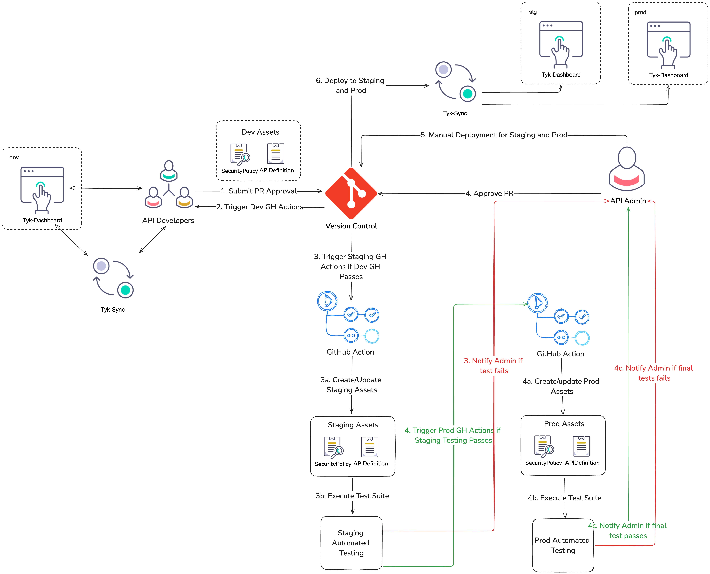

# Tyk CICD Example using Tyk Sync (WIP)
This project demonstrates how to create a GitOps/CICD pipeline for API Management with Tyk. It shows secure and effective ways to promote assets from lower to upper environments using accessible tools like [Tyk Sync](https://tyk.io/docs/product-stack/tyk-sync/overview/), [Spectral](https://github.com/stoplightio/spectral), and Shell Scripting. These solutions are just examples and not the only ways to address common DevOps challenges in the API promotion workflow.

## Overview
This repository assumes you have three standard environments: `dev`, `staging`, and `production`. The diagram below shows how these environments relate to each other and illustrates the workflow from development to staging and then to production.




Example VCS folder structure
```
├── infrastructure
    ├── dev 
    │   └── tyk
    │       ├── apis
    │       ├── assets
    │       └── policies
    ├── production 
    │   └── tyk
    │       ├── apis
    │       ├── assets
    │       └── policies
    └── staging
        └── tyk
            ├── apis
            ├── assets
            └── policies
```

The GitHub Action workflow files may look a bit messy because they demonstrate various methods for API linting and validation. By using different solutions like Shell Scripts and Spectral linting, the goal is to showcase all possible options available for these tasks.

You can review the complete CICD pipeline here: [https://github.com/TykTechnologies/tyk-cicd-dev-demo/actions/runs/10923225077](https://github.com/TykTechnologies/tyk-cicd-dev-demo/actions/runs/10923225077)

## Getting Started
### Prerequisites
1. Two Tyk environments that can be accessed from the GitHub actions.

### Steps
#### Step 1: Clone this repository and set up your GitHub repositories with two environments named staging and production.

#### Step 2: Configure GitHub Security for each deployment (staging and production)
Repository variables example
```
TYK_SYNC_REPO=tykio/tyk-sync
TYK_SYNC_VERSION=v1.5.1
```

Repository secrets example
```
TYK_STG_DASHBOARD_SECRET={TYK_DASHBOARD_API_CREDENTIALS}
TYK_STG_DASHBOARD_URL={TYK_DASHBOARD_URL}
STG_US_CONFIG_DATA={\"routes\": {\"default\": \"https://stg.httpbin.com\",\"stg1\": \"https://stg1.httpbin.com\",\"stg2\": \"https://stg2.httpbin.com\"}}
STG_US_PROXY_TARGET_URL=http://httpbin.org/get?env=stg

TYK_PROD_DASHBOARD_SECRET={TYK_DASHBOARD_API_CREDENTIALS}
TYK_PROD_DASHBOARD_URL={TYK_DASHBOARD_URL}
PROD_US_CONFIG_DATA={\"routes\": {\"default\": \"https://prod.httpbin.com\",\"prod1\": \"https://prod1.httpbin.com\",\"prod2\": \"https://prod2.httpbin.com\"}}
PROD_US_PROXY_TARGET_URL=http://httpbin.org/get?env=prod
```


## Useful Resources
Tyk Sync Dump Example Command
```
docker run -it --rm -v $(pwd):/tmp/data tykio/tyk-sync:v1.5.1 dump -d="{TYK_DASHBOARD_URL}" -s="{TYK_DASHBOARD_API_CREDENTIAL}" -t="/tmp/data" --apis="{API_ID}"
```

Local GH Action Development Using [act](https://nektosact.com/) Example Command
```
act push -s STG_US_CONFIG_DATA={\"hello\"\:\"world\"} -s ORG_NAME=tyk -s ORG_EMAIL=long@tyk.io -s STG_US_PROXY_TARGET_URL=httpbin2.org
```

Spectral / Stoplight Ruleset Example
```
rules:
  no-empty-target-url:
    description: APIs must have a target_url
    given: "$.api_definition.proxy"
    severity: error
    then:
      field: 'target_url'
      function: 'pattern'
      functionOptions:
        match: '^(?!\s*$).+'

  check-for-mtls-auth:
    description: MutualTLS is not enabled
    given: "$.api_definition"
    severity: warning
    then:
      field: enable_jwt 
      function: falsy

  validate-auth-methods:
    description: "Ensure that at least one of 'enable_jwt' or 'use_mutual_tls_auth' is true."
    given: "$.api_definition"
    then:
      - field: "enable_jwt"
        function: truthy
        functionOptions:
          negation: true # Should not be false
      - field: "use_mutual_tls_auth"
        function: truthy
        functionOptions:
          negation: true # Should not be false
    severity: error
    message: "At least one of 'api_definition.enable_jwt' or 'api_definition.use_mutual_tls_auth' must be true."
```

## References
1. [https://github.com/caroltyk/sync-data](https://github.com/caroltyk/sync-data)
2. [https://github.com/caroltyk/tyk-sync-demo](https://github.com/caroltyk/tyk-sync-demo)
